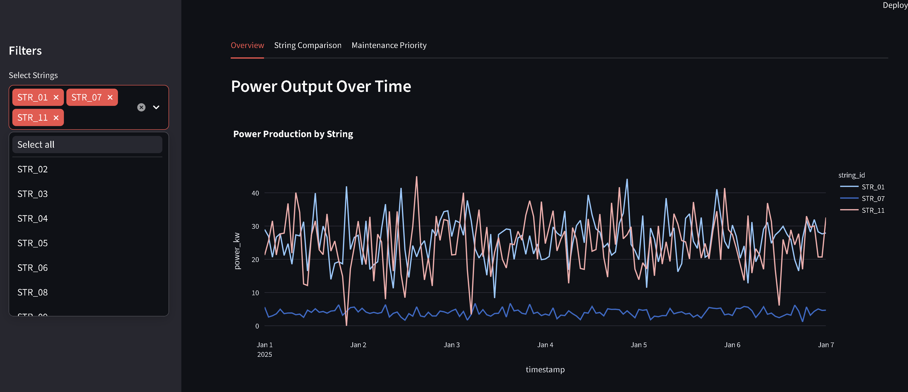
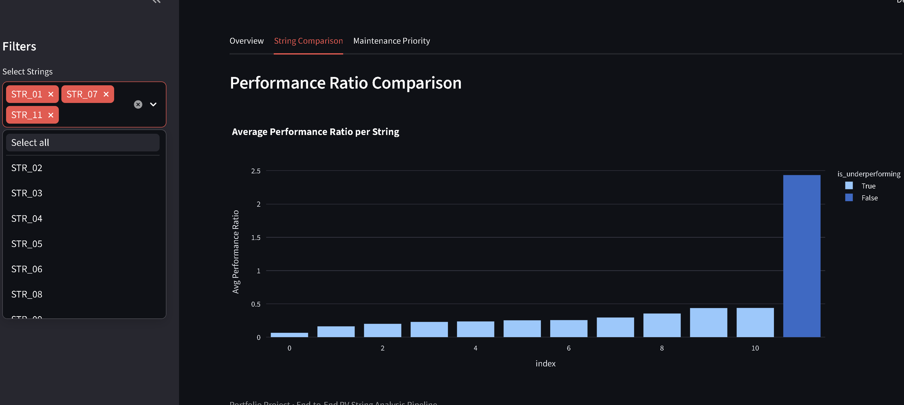
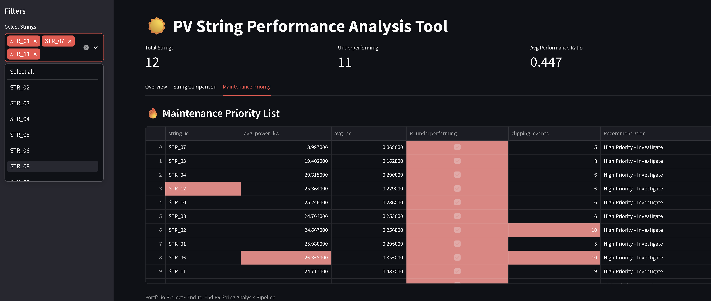

# PV String Performance Analysis Tool


\*\*Solar Portfolio Analytics Portfolio Project\*\*


A complete data tool designed to detect underperforming components in a solar PV plant by analyzing string-level performance.


\### Project Objective

Build an end-to-end data pipeline that transforms raw SCADA telemetry and wiring plans into actionable insights for improving solar asset performance.


\### Key Features

\- Data cleaning and structuring of raw telemetry

\- Creation of reliable per-string time series

\- Performance analysis across strings and inverters

\- Detection of underperformance, clipping, and other issues

\- Interactive visualizations and maintenance prioritization insights


\### Tech Stack

\- Python, pandas, NumPy

\- Plotly (interactive charts)

\- Streamlit (web dashboard)

\- Jupyter Notebooks


\### Project Structure


solar-string-analytics/

├── data/              # raw and processed data

├── src/               # Python code (pipeline)

├── notebooks/         # Analysis notebooks

├── dashboards/        # Streamlit app

├── reports/

├── docs/

├── requirements.txt

└── README.md


### Screenshots





*(Replace filenames with your actual screenshot names)*


\### How to Run (Local)

```bash

conda activate solar\_analysis

streamlit run dashboards/app.py


(Dashboard and detailed results will be added after completing the project)


This project shows my ability to handle real solar data challenges — cleaning, analysis, and delivering insights that help operations teams.


